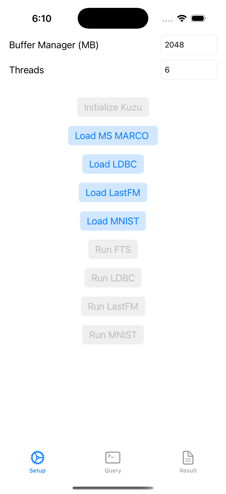

# kuzu-swift-demo

kuzu-swift-demo is a demo project that shows how to integrate [Kuzu Swift API bindings](https://github.com/kuzudb/kuzu-swift) into an iOS application. 

It shows how to:
- Create a Kuzu database
- Create node and relationship tables
- Copy data into the table
- Query data from the table
- Use the bundled full-text search index
- Use the bundled vector index

## Requirements

Xcode 16 or later, iOS 17 or later.

## Installation

1. Clone the repository
2. Open the project in Xcode
3. Select the target device or simulator
4. Build and run the project with `Cmd + R`

The required Kuzu Swift API bindings will be downloaded automatically when you build the project for the first time. The required datasets are bundled with the git repository, so you don't need to download them separately.

Note that if you would like to run the project on a physical device, you need to login to your Apple Developer account in Xcode and set up a provisioning profile for the project and may need to change the bundle identifier to a unique one in the project settings.

## Usage

1. **Launch the App**  
   Open the app on your iOS device or simulator.

2. **Setup Kùzu**  
   - Go to the **Setup** tab.
   - Enter the desired buffer pool size (MB) and number of threads.
   - Tap **Initialize Kuzu** to create a new Kùzu database instance.

3. **Load a Dataset**  
   - In the Setup tab, choose one of the available datasets:
     - **Load MS MARCO**
     - **Load LDBC**
     - **Load LastFM**
     - **Load MNIST**
   - Tap the corresponding button to load the dataset into the database.
   - **Note:** Only one dataset can be loaded per session. The database is created in a temporary directory. To load a different dataset, relaunch the app.

4. **Run Example Queries**  
   - After loading a dataset, the corresponding **Run** button (e.g., **Run FTS**, **Run LDBC**, etc.) becomes enabled.
   - Tap the button to execute a set of example queries on the loaded data.
   - Results and execution times will be displayed in the **Result** tab.

5. **Custom Cypher Queries**  
   - Switch to the **Query** tab.
   - Enter your own Cypher query in the text area.
   - Tap **Run** to execute the query. The results will appear in the **Result** tab.
   - Use the **Clear** button to clear the query input.

6. **View Results**  
   - The **Result** tab displays output and logs from all operations, including initialization, data loading, and query results.
   - Use the **Clear** button in the Result tab to clear the output.

## License

This project is licensed under the MIT License. See the [LICENSE](LICENSE) file for details.
